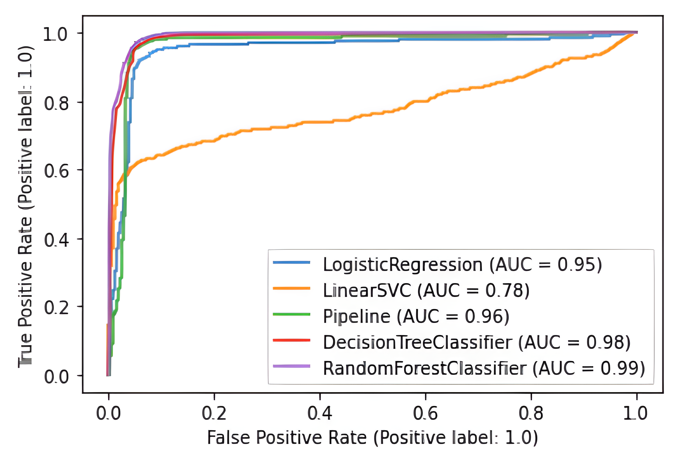
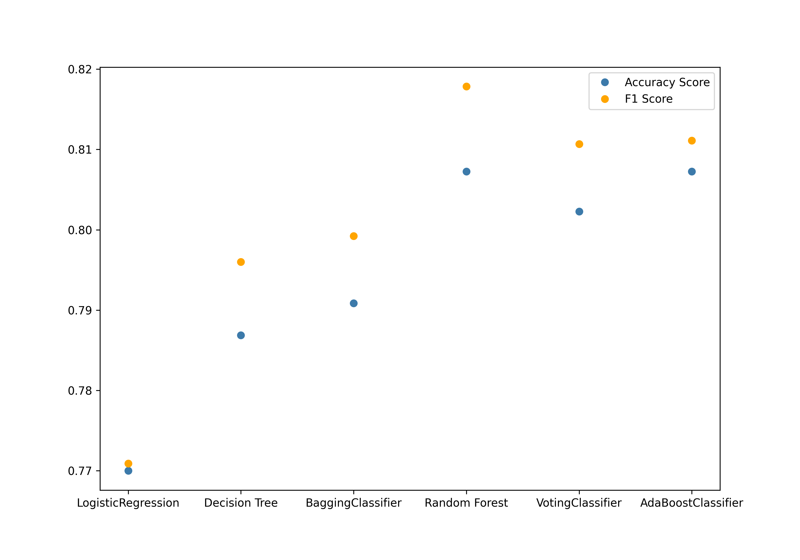

# Bank Marketing Prediction

The data is related with direct marketing campaigns (phone calls) of a Portuguese banking institution. The classification goal is to predict if the client will subscribe a term deposit (variable y).

- Data Set Characteristics: Multivariate
- Attribute Characteristics: Real
- Number of Instances: 45211
- Number of Attributes: 17

## Source
Data can be found in UCI Machine Learning Repository here: https://archive.ics.uci.edu/ml/datasets/bank+marketing

Original Paper: [Moro et al., 2014] S. Moro, P. Cortez and P. Rita. A Data-Driven Approach to Predict the Success of Bank Telemarketing. Decision Support Systems, Elsevier, 62:22-31, June 2014

## Data Set Information
Dataset contains 45211 examples and 17 inputs, ordered by date from May 2008 to November 2010
- ### Attribute Information
    - age (numeric)
    - job : type of job (categorical: 'admin.','blue-collar','entrepreneur','housemaid','management','retired','self-employed','services','student','technician','unemployed','unknown')
    - marital : marital status (categorical: 'divorced','married','single','unknown'; note: 'divorced' means divorced or widowed)
    - education (categorical: 'basic.4y','basic.6y','basic.9y','high.school','illiterate','professional.course','university.degree','unknown')
    - default: has credit in default? (categorical: 'no','yes','unknown')
    - balance: Amount of money in bank account (numeric:positive and negative integers)
    - housing: has housing loan? (categorical: 'no','yes','unknown')
    - loan: has personal loan? (categorical: 'no','yes','unknown')
    #### Related with the last contact of the current campaign:
    - contact: contact communication type (categorical: 'cellular','telephone')
    - month: last contact month of year (categorical: 'jan', 'feb', 'mar', ..., 'nov', 'dec')
    - day_of_week: last contact day of the week (categorical: 'mon','tue','wed','thu','fri')
    - duration: last contact duration, in seconds (numeric). 
    #### Other Attributes:
    - campaign: number of contacts performed during this campaign and for this client (numeric, includes last contact)
    - pdays: number of days that passed by after the client was last contacted from a previous campaign (numeric; 999 means client was not previously contacted)
    - previous: number of contacts performed before this campaign and for this client (numeric)
    - poutcome: outcome of the previous marketing campaign (categorical: 'failure','nonexistent','success') 
    #### Output variable (desired target):
    - y: has the client subscribed a term deposit? (binary: 'yes','no')

## Method and Results
> *_NOTE:Refer above respective Jupyter Notebooks for detailed information on Confusion matrix,Precision scores and Recall scores._*

'poutcome' attribute plays a big role in accuracy of prediction of target variable. But in real life it may be the case that a bank would not have information regarding previous outcome if they are offering term deposits first time. Hence two ways of approaching the problem was necessary. 
- ### With 'poutcome'
    Some 'poutcome' instances are missing, so first built a RandomForestClassifier for binary classification and then use this along with other attributes to predict 'y'.  
    Even though we use 'poutcome' which was predicted with the accuracy of 57.8%, we still get final 'y' attribute with high accuracy scores.(Natuaraly people who subscribed for term deposit last time through this approach will have higher chances of subscribing once again)
    #### Scores for models
    - Logistic Regression: 93.7%
    - LinearSVC: 90.6%
    - Polynomial SVM: 95.2%
    - Decision Tree Classifier: 95.6%
    - Random Forest Classifier: 96.7%
    - Voting Classifier: 96.7%
    #### ROC curves
    
- ### Without 'poutcome'
    A real world senario will generally exclude 'poutcome' attribute to get models to predict accurately even though we don't have the most impactfull atrribute.

    #### Scores for models
    - Logistic Regression: 76.9%
    - Decision Tree Classifier: 78.6%
    - Bagging Classifier: 79.0%
    - Random Forest Classifier: 80.7%
    - Voting Classifier: 80.2%
    - AdaBoost Classifier: 80.7%/  
    
    #### ROC Curves
    
